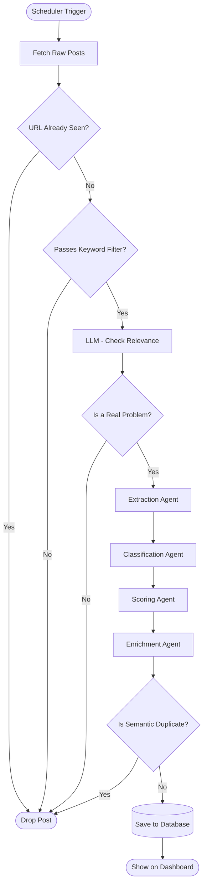
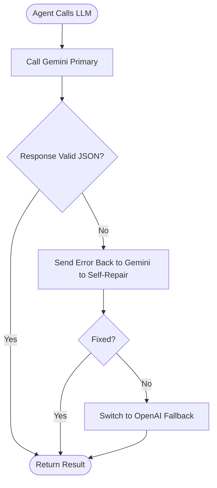
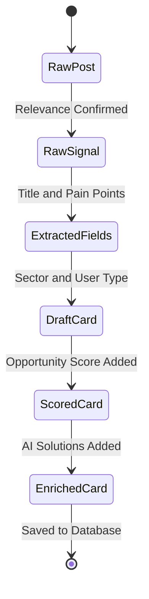

# ProblemLens — Agent Workflow

## Flowchart

---

## LLM Fallback Strategy

Every agent marked **LLM** above runs through this safety net internally:

---

## Data Transformation

---

## Agent Reference

| Agent | File | Input | Output |
|---|---|---|---|
| Fetchers | `agents/fetchers/*.py` | SourceConfig | RawPost |
| Discovery | `agents/discovery.py` | RawPost list | RawSignal list |
| Extraction | `agents/extraction.py` | RawSignal | ExtractedFields |
| Classification | `agents/classification.py` | ExtractedFields | DraftCard |
| Scoring | `agents/scoring.py` | DraftCard | ScoredCard |
| Enrichment | `agents/enrichment.py` | ScoredCard | EnrichedCard |
| Dedup | `agents/dedup.py` | EnrichedCard | FinalCard |
